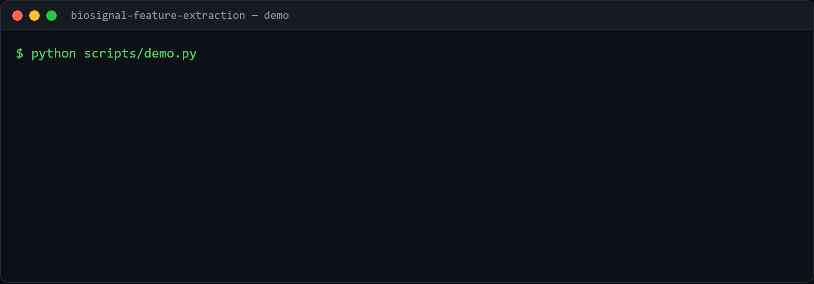

# biosignal-feature-extraction

[](https://github.com/SamirDiegoChavezCaceres/biosignal-feature-extraction/actions/workflows/ci.yml)  

Turn a raw 1-D signal into features a model can use: **spectral band power**
(FFT) and **wavelet energy** (DWT). A compact, well-tested take on the classic
first step of any biosignal or sensor pipeline.

Everything runs on synthetic signals, so there is nothing to download.

## Demo



The demo (`scripts/demo.py`) runs offline on synthetic 1-D signals generated at
three dominant frequencies (sampled at 128 Hz). It (1) prints the FFT band power
(delta, theta, alpha, beta, gamma) per signal class, showing each class peaks in
its own band, and (2) trains a classifier on the combined FFT band and wavelet
energy features and reports its accuracy.

Generate it with [VHS](https://github.com/charmbracelet/vhs): `vhs demo.tape`.

## What it shows

- **Spectral band power** - the share of a signal's energy in each frequency
  band, via the FFT. Pure numpy. The default bands are the usual EEG bands, but
  you pass your own for ECG, vibration, audio, etc.
- **Wavelet energy** - energy per DWT level (PyWavelets), which captures
  transient, non-stationary structure that a plain FFT smears across time.
- **End to end** - signals become a feature matrix and a classifier that tells
  three spectral classes apart with >90% accuracy, so you can see the features
  actually carry signal.

## Run it

```bash
pip install -e .
python scripts/demo.py
# band power of a 10 Hz signal: ... -> dominant band: alpha
# classification of three spectral classes: {'accuracy': 0.9x, 'n_features': 10}
```

```python
from biosignal import band_power, wavelet_energy
band_power(signal, fs=128)      # {'delta':.., 'theta':.., 'alpha':.., 'beta':.., 'gamma':..}
wavelet_energy(signal, "db4")   # energy per decomposition level
```

## Results

The FFT + wavelet features separate the three synthetic spectral classes at
**>0.9 accuracy** (1.0 on the default seed). Reproduce:

```bash
python scripts/demo.py
```

## Tests

```bash
pip install -e ".[dev]"
pytest
```

Covers that band power lands in the correct band for known frequencies, that
wavelet energies normalize, and that the extracted features separate the classes
(with and without the wavelet family).

## Limitations and next steps

- The synthetic signals are cleanly separable; real biosignals carry artifacts
  and drift this does not model.
- There is no denoising or artifact-rejection step before feature extraction.
- Next: add bandpass filtering and test on a public dataset.

## License

MIT.
